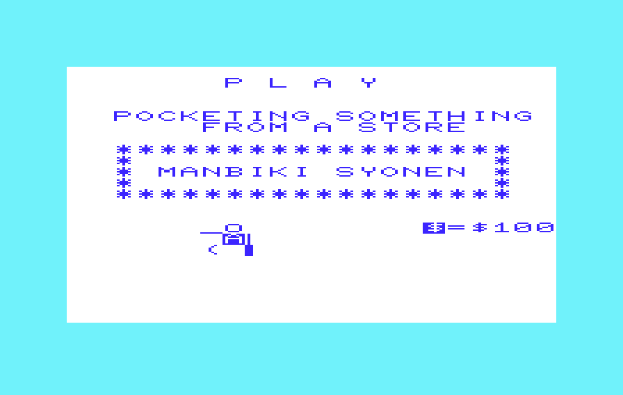
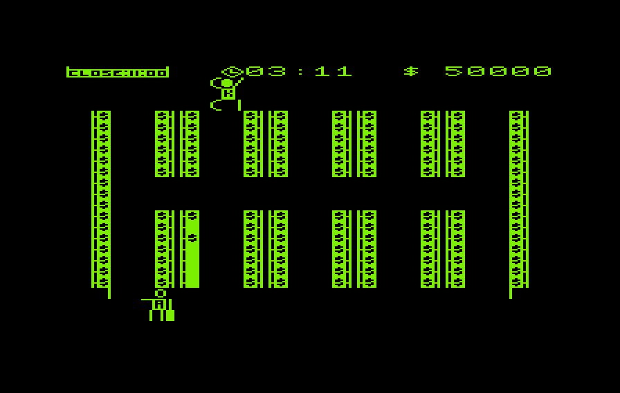
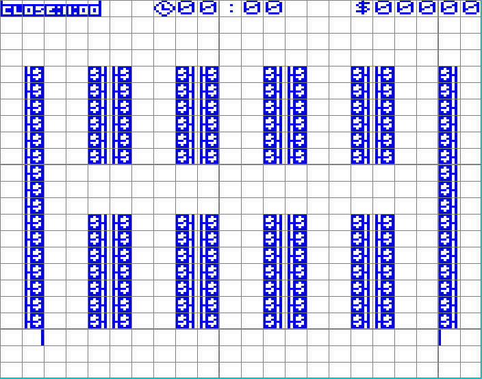
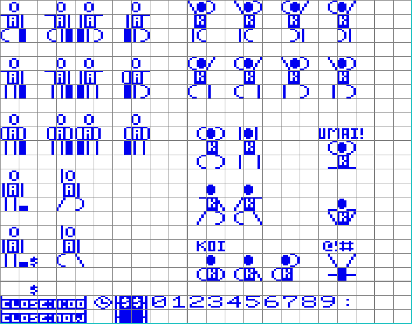

# VIC-20 Manbiki Shonen (8k)
This is a VIC-20 conversion of a "lost" japanese stealth game originally written for the Commodore PET.
 

The goal was to try and make the least amount of changes to the source in order to preserve the feel of the original.  I targetted the 8K VIC-20 due to the original targetting the 8K PET.

## History
Thanks to Robin from 8-Bit Show And Tell for his discovery and north american release of this lost 1979 pet stealth game (presumed to be the first stealth game ever). 

His video is amazing: https://www.youtube.com/watch?v=reuCZf2Yhfk

The PET version is available here: https://8bitshowandtell.com/downloads/manbiki.d64

## TL/DR HOW DO I PLAY IT ON MY VIC-20!
Easiest way to play:
1. Download the standalone [manbikishonen.prg](https://raw.githubusercontent.com/sdesros/vic-manbiki-shonen/master/manbikishonen.prg) file.
2. Run it on your 8K Vic-20
3. "S" to start on the title screen ("P" on the title-screen will change it to "PET" color, "V" back to VIC-20)
4. Use A - D (left and right), P - L (up and down) and "SPACE" for shoplifting.
    * You can also use cursor keys for movement (for emulators)
5. Enjoy! :)

Or via a browser based emulator:
https://sdesros.ca/vic20/?gamefile=manbikishonen (if it doesn't load properly, hit the stop button and play)

### Conversion Notes
This version is a conversion from Robin's slightly optimized version of the game "Shoplifting Boy".

Changes made:
* Conversion of the audio is approximate.  Tried to map the PET tones used to the VIC-20's, but not always possible due to how they are ordered.
* Reformated most screens for the VIC-20's 22x23 display.
  * Some animations are shorter
  * Introduced extra delay in the kick animation.
* The actual game board is recreated using custom defined VIC-20 graphics to best fit the game on a smaller screen. 
  * Characters occupy 1.5 columns instead of 3 and will move in "half" column increments. 
  * Shelves are merged into 1 character instead of using 2 different characters. 
  * In order to fit the whole play area I had to collapse the top score area into 1 row and move the warden up more.
  * Therefore there is some minor changes to game logic to accomodate the half steps, different characters and new spacing.
  * VIC-20 will only use this character set during game play
* Control changes:
  * Press "P" on title screen to change the screen and colour to "PET" mode (black on green)
  * Press "V" on title screent o change it back to default VIC-20 mode.
  * Use A-D for left right, P-L for up and down (or use cursor keys).
* Due to eccentricities of VIC-20s with 8K+ ram expansion, there are additional setup files required to properly setup.  See the BUILD section.

## Project structure
This project was created in [CBM Prg Studio](https://www.ajordison.co.uk/)
### Key Files
* [BASIC Files/manbiki-vic.bas ](https://github.com/sdesros/vic-manbiki-shonen/blob/master/BASIC%20Files/manbiki-vic.bas) - Actual game file.
* [BASIC Files/boot.bas](https://github.com/sdesros/vic-manbiki-shonen/blob/master/BASIC%20Files/boot.bas) - Simple file to sets up the environment (You may need to cursor up to the first line and hit return manuallly down the various to get it to work properly as the first line seems to be ignored.)
* [BASIC Files/bootloader.bas](https://github.com/sdesros/vic-manbiki-shonen/blob/master/BASIC%20Files/bootloader.bas) Only required when building a standalone program. (See build)
* [BASIC Files/chars.bin](https://github.com/sdesros/vic-manbiki-shonen/blob/master/BASIC%20Files/chars.bas) - Creates the custom character set in memory, displays a sheet of them, waits for a key and attempts to load the game. (May need to manually scroll up to the first line and hit return manually)
* [Character Sets/game_play_characters.cst](https://github.com/sdesros/vic-manbiki-shonen/blob/master/Character%20Sets/game_play_characters.cst) - Custom Character set defined in CBM Prg Studio
* [character_sheets.sdd](https://github.com/sdesros/vic-manbiki-shonen/blob/master/character_sheets.sdd) = A screen sheet displaying all of the custom character sets and how they are used defined in CBM Prg Studio
* [gameboard.sdd](https://github.com/sdesros/vic-manbiki-shonen/blob/c995808b5b5700fea6717d8dfc863718427ec9eb/gameboard.sdd) - A screen sheet display the game board defined in CBM Prg Studio

## How to build and run
### Environment
Due to how the VIC-20 rearranges its memory map when dealing with memory exansions, 8k+ VIC-20s makes working with custom character sets a little cumbersome. There was not enough space to squeeze them into the tape buffer, so I needed to move the start of basic pointer in order to store the character set in an accessible location.

### Building
You can use CBM Prg Studio to convert all of the BASIC files into PRG files.  Use the already existing PRG files in the root of this project or the [d64](https://github.com/sdesros/vic-manbiki-shonen/raw/master/manbikid64.d64) file if you haven't made any code changes.

#### Running the game using multiple files
1. Move top of basic by either:
   * running the boot.prg `load"boot",8` (keyboard buffer doesn't seem to work reliably, you may need to move the cursor to first line and manually hit return to run all commands in order.).
   * typing `POKE44,28:POKE7168,0:NEW`
2. Load the custom character set by running chars.prg `load"chars",8` and `run`ning it.
   * Once the characters are displayed, hit any key.
   * The auto loader might not be working properly so move to step 3.
3. Load and run the manbiki-vic.prg `load"manbiki-vic",8`.

#### Standalone file
##### Structure
First thanks to Mike at Denial for this post: https://sleepingelephant.com/ipw-web/bulletin/bb/viewtopic.php?p=54096#p54096  and whoever posted this recipe: https://www.boray.se/commodore/expandedvic20.html.  It reinvogorated this project! :)

There is a pre-built standalone file here: [manbikishonen.prg](https://raw.githubusercontent.com/sdesros/vic-manbiki-shonen/master/manbikishonen.prg) 

In short, the file is structured as such:
* Small basic stub located at the start of basic (4068) that simply includes instructions to move the top of basic up to 7169 and "runs" the program. See [BASIC Files/bootloader.bas](https://github.com/sdesros/vic-manbiki-shonen/blob/master/BASIC%20Files/bootloader.bas)
* the custom character set data is found at memory location 5120
* The actual game program is located at 7169

When the standalone file is initially loaded, list will only show the stub.  Running the program will move the start of basic and run the game located at the new start of basic location.  You'll be able to see the game listing if you stop the running program.

##### Building the standalone program
1. Either follow the steps in BOOT.PRG [BASIC Files/boot.bas](https://github.com/sdesros/vic-manbiki-shonen/blob/master/BASIC%20Files/boot.bas) **OR**
  * Load the bootloader.prg `load"bootloader",8`.
  * Move the top of basic: `POKE44,28:POKE7168,0:NEW`
  * Load the custom character set by running chars.prg `load"chars",8` and `run`ning it.
    * hit any keys once the character set is displayed.
3. Load but DON'T run the manbiki-vic.prg `load"manbiki-vic",8`.
  * or just break out of the program during the title screen.
3. Reset the start of basic and save the new standalone file: `POKE44,18:SAVE"NAME",8`   
